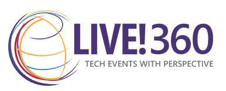

# VS Live 360 - Vectorization Fundamentals
This is the repo for the November 20th 2024 session for VS Live 360 conference in Orlando, FL.

## Presenter: Lino Tadros

### [LinkedIn](https://www.linkedin.com/in/linotadros/)

## Session Description
In the world of Generative AI, passing a whole document, bunch of documents, database with multiple tables, datalakes or other source of knowledge bases to augment the prompt for LLM (RAG) requires what we call Embedding and Vectorization to reduce the amount of token usage during the LLM call but most importantly to perform more accurate retrieval based on semantic meaning. In this session, you will learn about the process of ingesting data, extracting data (Chunking and overlapping), embedding (using ada-002 and ada-003) and vectorization of the data and the chat question asked to retrieve accurate and meaningful response. We will also discuss multiple Vector databases that you can use to store the vectorization results like Pinecone, FAISS, ChromaDB, Azure PostgresSQL and Azure AI Search.

## I hope you enjoy the session!
### Looking forward to seeing you in next year's VS Live 360 conference!
